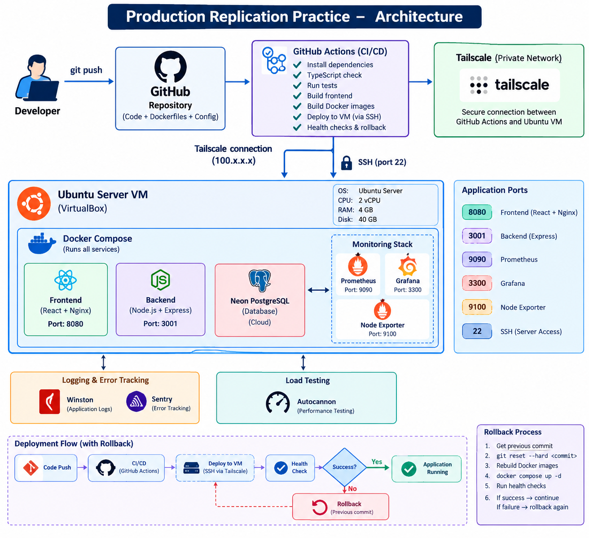
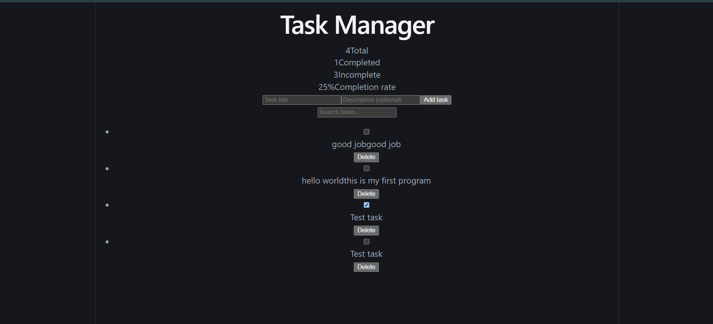
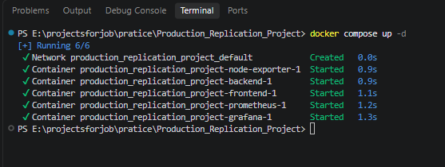
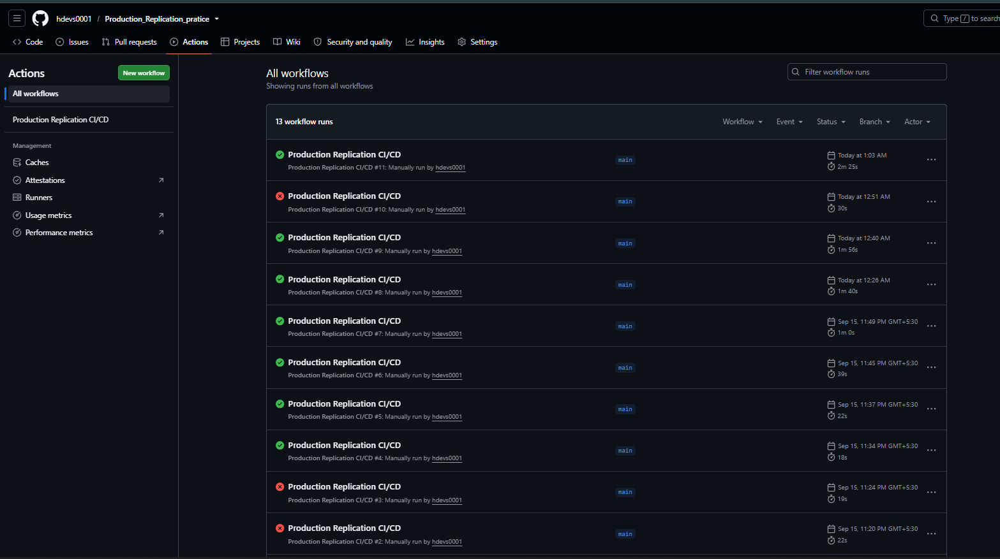
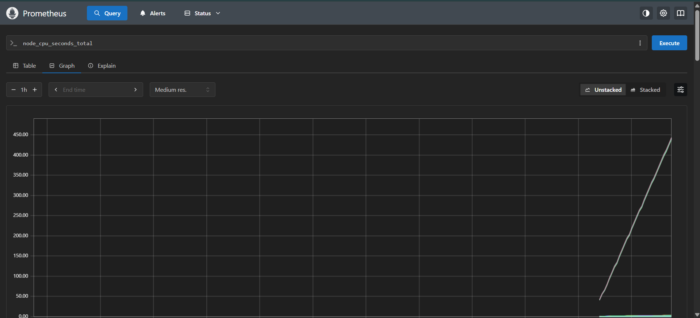
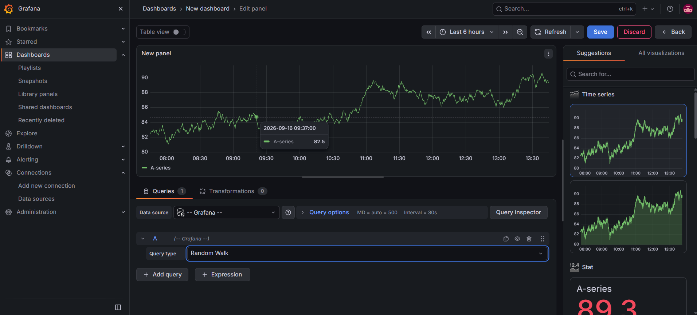

# Production Replication Practice 🚀

A full-stack task management application built as a practical **DevOps / CI/CD / production deployment learning project**.

The main purpose of this project is not only to build a frontend and backend, but to understand how an application moves from:

**Development → Testing → Docker → Deployment → Monitoring → Health Checks → Rollback**

The application is deployed on a local Ubuntu Server VM and is accessible remotely through **Tailscale**.

---

## 📌 Table of Contents

* [Project Overview](#-project-overview)
* [What We Built](#-what-we-built)
* [Tech Stack](#-tech-stack)
* [Architecture](#-architecture)
* [Project Structure](#-project-structure)
* [Application Components](#-application-components)
* [Docker Architecture](#-docker-architecture)
* [Monitoring Architecture](#-monitoring-architecture)
* [CI/CD Pipeline](#-cicd-pipeline)
* [Deployment Architecture](#-deployment-architecture)
* [Ubuntu Server Setup](#-ubuntu-server-setup)
* [Install Git](#1-install-git)
* [Install Docker](#2-install-docker)
* [Install Docker Compose](#3-check-docker-compose)
* [Install and Configure Tailscale](#4-install-tailscale)
* [Clone the Repository](#5-clone-the-repository)
* [Environment Variables](#6-environment-variables)
* [Run the Application](#7-run-the-application)
* [Useful Docker Commands](#-useful-docker-commands)
* [Useful Linux Commands](#-useful-linux-commands)
* [Health Checks](#-health-checks)
* [Prometheus](#-prometheus)
* [Grafana](#-grafana)
* [CI/CD GitHub Actions](#-cicd-github-actions)
* [Rollback](#-rollback)
* [Cleanup](#-cleanup)
* [Screenshots](#-screenshots)
* [Lessons Learned](#-lessons-learned)
* [Future Improvements](#-future-improvements)

---

# 📖 Project Overview

This project is a simple task management application consisting of:

* React frontend
* Express/Node.js backend
* Neon PostgreSQL database
* Docker containers
* Docker Compose
* Prometheus monitoring
* Grafana dashboards
* Node Exporter
* Winston logging
* Sentry error tracking
* GitHub Actions CI/CD
* Tailscale private networking
* Ubuntu Server VM
* SSH-based deployment
* Health checks
* Deployment rollback
* Docker cleanup

The project was built as a hands-on environment to understand how a web application can be deployed and monitored using production-style practices.

---

# 🛠️ What We Built

The application follows this general workflow:

```text
Developer
   │
   │ git push
   ▼
GitHub Repository
   │
   ▼
GitHub Actions
   │
   ├── Install dependencies
   ├── TypeScript check
   ├── Run tests
   ├── Build frontend
   │
   ▼
Tailscale Network
   │
   ▼
SSH
   │
   ▼
Ubuntu Server VM
   │
   ▼
Docker Compose
   │
   ├── Frontend
   ├── Backend
   ├── Prometheus
   ├── Grafana
   └── Node Exporter
```

---

# ⚙️ Tech Stack

| Category                | Technology                     |
| ----------------------- | ------------------------------ |
| Frontend                | React + Vite + TypeScript      |
| Backend                 | Node.js + Express + TypeScript |
| Database                | PostgreSQL / Neon              |
| ORM / Database Layer    | Drizzle                        |
| Containerization        | Docker                         |
| Container Orchestration | Docker Compose                 |
| Reverse/Web Server      | Nginx                          |
| Monitoring              | Prometheus                     |
| Dashboards              | Grafana                        |
| System Metrics          | Node Exporter                  |
| Application Logging     | Winston                        |
| Error Tracking          | Sentry                         |
| Load Testing            | Autocannon                     |
| CI/CD                   | GitHub Actions                 |
| Private Network         | Tailscale                      |
| Server                  | Ubuntu Server                  |
| Virtualization          | Oracle VirtualBox              |
| Remote Deployment       | SSH                            |

---

# 🏗️ Architecture

## High-Level Architecture

```text
                         ┌─────────────────────┐
                         │      Developer      │
                         │                     │
                         │  Code / Git Push    │
                         └──────────┬──────────┘
                                    │
                                    ▼
                         ┌─────────────────────┐
                         │       GitHub        │
                         │     Repository      │
                         └──────────┬──────────┘
                                    │
                                    ▼
                         ┌─────────────────────┐
                         │   GitHub Actions    │
                         │                     │
                         │  CI + Build + Deploy│
                         └──────────┬──────────┘
                                    │
                                    │ Tailscale
                                    ▼
                    ┌─────────────────────────────┐
                    │       Ubuntu Server VM      │
                    │                             │
                    │        Docker Compose       │
                    │                             │
                    │ ┌─────────┐  ┌───────────┐ │
                    │ │Frontend │  │ Backend   │ │
                    │ │ React   │  │ Express   │ │
                    │ │ Nginx   │  │ Node.js   │ │
                    │ └─────────┘  └─────┬─────┘ │
                    │                    │       │
                    │                    ▼       │
                    │              ┌──────────┐  │
                    │              │  Neon DB │  │
                    │              └──────────┘  │
                    │                             │
                    │ ┌────────────┐              │
                    │ │ Prometheus │◄─────────────┤
                    │ └─────┬──────┘              │
                    │       │                     │
                    │       ▼                     │
                    │ ┌────────────┐              │
                    │ │  Grafana   │              │
                    │ └────────────┘              │
                    │                             │
                    │ ┌──────────────┐            │
                    │ │Node Exporter │            │
                    │ └──────────────┘            │
                    └─────────────────────────────┘
```

---

## 🖼️ Architecture Diagram

You can create a cleaner architecture diagram and place it here.

**Recommended location:**

```text
docs/images/architecture.png
```

Then put:

```markdown

```

### Architecture Diagram


> Replace the image above with your actual architecture diagram.

---

# 📂 Project Structure

```text
Production_Replication_pratice/
│
├── .github/
│   └── workflows/
│       └── deploy.yml
│
├── backend/
│   ├── src/
│   ├── tests/
│   ├── Dockerfile
│   ├── package.json
│   ├── package-lock.json
│   └── .env
│
├── frontend/
│   ├── src/
│   ├── public/
│   ├── Dockerfile
│   ├── nginx.conf
│   ├── package.json
│   └── package-lock.json
│
├── docs/
│   └── images/
│
├── docker-compose.yml
├── prometheus.yml
├── README.md
└── .gitignore
```

---

# 🧩 Application Components

## Frontend

The frontend is built using:

* React
* TypeScript
* Vite
* Nginx

The frontend is compiled into static files and served using Nginx.

Container port:

```text
8080
```

Access:

```text
http://SERVER_IP:8080
```

---

## Backend

The backend is built using:

* Node.js
* Express
* TypeScript
* Drizzle
* Neon PostgreSQL
* Winston
* Sentry

The backend provides APIs for the task application.

Container port:

```text
3001
```

Health endpoint:

```text
GET /health
```

Example:

```bash
curl http://localhost:3001/health
```

---

# 🐳 Docker Architecture

The application is containerized using Docker.

Docker Compose manages the complete application stack.

```text
                    Docker Compose
                         │
       ┌─────────────────┼─────────────────┐
       │                 │                 │
       ▼                 ▼                 ▼
   Frontend           Backend          Monitoring
       │                 │                 │
       │                 │        ┌────────┼────────┐
       │                 │        │        │        │
       ▼                 ▼        ▼        ▼        ▼
     Nginx            Node.js  Prometheus Grafana Node
                                                    Exporter
```

---

# 📊 Monitoring Architecture

Prometheus collects metrics and Grafana displays them.

```text
                    ┌───────────────┐
                    │   Prometheus  │
                    └───────┬───────┘
                            │
              ┌─────────────┴─────────────┐
              │                           │
              ▼                           ▼
       Backend Metrics              Node Exporter
                                          │
                                          ▼
                                   Server Metrics
                                          │
                                          ▼
                                  CPU / Memory /
                                  Disk / System
                            
                            │
                            ▼
                     ┌─────────────┐
                     │   Grafana   │
                     └─────────────┘
```

Prometheus:

```text
http://SERVER_IP:9090
```

Grafana:

```text
http://SERVER_IP:3300
```

Node Exporter:

```text
http://SERVER_IP:9100
```

---

# 🚀 CI/CD Pipeline

The project uses GitHub Actions for deployment.

The pipeline follows:

```text
                Git Push
                   │
                   ▼
          ┌─────────────────┐
          │ GitHub Actions  │
          └────────┬────────┘
                   │
                   ▼
                 CI
                   │
       ┌───────────┼───────────┐
       │           │           │
       ▼           ▼           ▼
   npm ci       TypeScript    Tests
       │          Check         │
       └───────────┬───────────┘
                   │
                   ▼
             Build Frontend
                   │
                   ▼
              Tailscale
                   │
                   ▼
                 SSH
                   │
                   ▼
             Ubuntu VM
                   │
                   ▼
          Git Pull / Reset
                   │
                   ▼
          Docker Compose Build
                   │
                   ▼
          Docker Compose Up
                   │
                   ▼
             Health Checks
                   │
          ┌────────┴────────┐
          │                 │
        PASS               FAIL
          │                 │
          ▼                 ▼
       Success           Rollback
          │                 │
          └────────┬────────┘
                   ▼
                Cleanup
```

---

# 🔐 Tailscale

Tailscale is used to create a private network between:

```text
GitHub Actions
       │
       │ Tailscale
       ▼
Ubuntu VM
```

Instead of exposing SSH directly to the public internet, the GitHub Actions runner connects to the VM using its Tailscale IP.

Example:

```text
100.x.x.x
```

SSH uses port:

```text
22
```

Example:

```bash
ssh harman@100.x.x.x
```

---

# 🖥️ Ubuntu Server Setup

The project was deployed on an Ubuntu Server VM running inside VirtualBox.

Example environment:

```text
OS: Ubuntu Server
Architecture: AMD64
CPU: 2 vCPU
RAM: 4 GB
Disk: 40 GB
```

---

# 1. Install Git

Update package information:

```bash
sudo apt update
```

Install Git:

```bash
sudo apt install git -y
```

Check:

```bash
git --version
```

---

# 2. Install Docker

Install Docker from Ubuntu packages:

```bash
sudo apt update
sudo apt install docker.io -y
```

Start Docker:

```bash
sudo systemctl start docker
```

Enable Docker on boot:

```bash
sudo systemctl enable docker
```

Check Docker:

```bash
docker --version
```

Check Docker service:

```bash
sudo systemctl status docker
```

---

# 3. Check Docker Compose

Docker Compose is available through the Docker Compose V2 package.

Check:

```bash
docker compose version
```

Example:

```text
Docker Compose version v2.x.x
```

---

# 4. Install Tailscale

Install Tailscale:

```bash
curl -fsSL https://tailscale.com/install.sh | sh
```

Start Tailscale:

```bash
sudo tailscale up
```

Check Tailscale status:

```bash
tailscale status
```

Get the Tailscale IP:

```bash
tailscale ip
```

Example:

```text
100.x.x.x
```

---

# 5. Clone the Repository

Clone the repository:

```bash
git clone https://github.com/hdevs0001/Production_Replication_pratice.git
```

Enter the project:

```bash
cd Production_Replication_pratice
```

Check files:

```bash
ls
```

Expected:

```text
backend
frontend
docker-compose.yml
prometheus.yml
README.md
```

---

# 6. Environment Variables

The backend requires environment variables.

Example:

```env
DATABASE_URL="your-neon-database-url"
DATABASE_URL_UNPOOLED=""
SENTRY_DSN="your-sentry-dsn"
FRONTEND_URL="http://localhost:5173"
```

Create the file:

```bash
nano backend/.env
```

Add your environment variables.

> Never commit `.env` files containing real secrets to GitHub.

The `.gitignore` file should contain:

```text
.env
.env.*
```

---

# 7. Run the Application

From the project root:

```bash
docker compose up --build -d
```

What this does:

```text
docker compose
      │
      ├── Build backend image
      ├── Build frontend image
      ├── Pull Prometheus
      ├── Pull Grafana
      ├── Pull Node Exporter
      └── Start containers
```

Check containers:

```bash
docker compose ps
```

View logs:

```bash
docker compose logs
```

View backend logs:

```bash
docker compose logs backend
```

View frontend logs:

```bash
docker compose logs frontend
```

Follow logs:

```bash
docker compose logs -f
```

---

# 🛑 Stop the Application

```bash
docker compose down
```

This stops and removes the containers.

To stop containers without removing them:

```bash
docker compose stop
```

---

# 🔄 Restart the Application

```bash
docker compose restart
```

Or:

```bash
docker compose up -d
```

---

# 🧹 Rebuild the Application

After code changes:

```bash
docker compose down
```

Then:

```bash
docker compose build
```

Then:

```bash
docker compose up -d
```

Or simply:

```bash
docker compose up --build -d
```

---

# 🐳 Useful Docker Commands

List running containers:

```bash
docker ps
```

List all containers:

```bash
docker ps -a
```

List images:

```bash
docker images
```

View container logs:

```bash
docker logs <container-name>
```

Follow container logs:

```bash
docker logs -f <container-name>
```

Inspect a container:

```bash
docker inspect <container-name>
```

Remove unused images:

```bash
docker image prune
```

Remove unused containers/images/networks:

```bash
docker system prune
```

> Be careful with `docker system prune` because it can remove unused Docker resources.

---

# 🐧 Useful Linux Commands

Check current directory:

```bash
pwd
```

List files:

```bash
ls
```

Detailed listing:

```bash
ls -la
```

Change directory:

```bash
cd <directory>
```

Go back:

```bash
cd ..
```

Create directory:

```bash
mkdir <directory>
```

Remove file:

```bash
rm <file>
```

Remove directory:

```bash
rm -r <directory>
```

Check disk:

```bash
df -h
```

Check memory:

```bash
free -h
```

Check CPU/processes:

```bash
top
```

Check running services:

```bash
systemctl --type=service
```

---

# ❤️ Health Checks

Health checks are used to verify whether the application is actually working after deployment.

Backend:

```bash
curl --fail \
  --silent \
  --show-error \
  http://localhost:3001/health
```

Frontend:

```bash
curl --fail \
  --silent \
  --show-error \
  http://localhost:8080/
```

Prometheus:

```bash
curl \
  --fail \
  --silent \
  --show-error \
  http://localhost:9090/-/healthy
```

Grafana:

```bash
curl \
  --fail \
  --silent \
  --show-error \
  http://localhost:3300/api/health
```

---

# 📈 Prometheus

Prometheus is responsible for collecting metrics.

Configuration:

```text
prometheus.yml
```

Prometheus container:

```text
prom/prometheus
```

Access:

```text
http://SERVER_IP:9090
```

Health endpoint:

```text
http://SERVER_IP:9090/-/healthy
```

---

# 📊 Grafana

Grafana is used to visualize monitoring data.

Grafana connects to Prometheus as a data source.

Access:

```text
http://SERVER_IP:3300
```

Typical monitoring information can include:

* CPU usage
* Memory usage
* Disk usage
* Application metrics
* Request metrics
* System metrics

---

# 🖥️ Node Exporter

Node Exporter collects system-level metrics from the Ubuntu server.

It provides information such as:

```text
CPU
Memory
Disk
Filesystem
Network
```

Port:

```text
9100
```

---

# 📝 Logging

The backend uses Winston for application logging.

Logs can be inspected using Docker:

```bash
docker compose logs backend
```

The project also uses a Docker volume for backend logs:

```text
backend-logs
```

---

# 🚨 Error Tracking

Sentry is used for application error tracking.

The backend receives the Sentry DSN through an environment variable:

```env
SENTRY_DSN=your-sentry-dsn
```

The actual secret value should never be committed to GitHub.

---

# ⚡ Load Testing

The application can be tested under load using Autocannon.

Example:

```bash
npx autocannon http://localhost:3001/health
```

Example with concurrency:

```bash
npx autocannon -c 100 -d 10 http://localhost:3001/health
```

Where:

```text
-c = concurrency
-d = duration in seconds
```

This helps understand:

* Latency
* Throughput
* Requests per second
* Concurrent connections
* Server behavior under load

---

# 🔁 Deployment Process

The deployment process on the Ubuntu VM is approximately:

```bash
cd /home/harman/proud-rep

git fetch origin main

git reset --hard origin/main

docker compose build

docker compose up -d

docker compose ps
```

Then health checks are performed.

---

# 🔙 Rollback

Before deployment, the previous Git commit is recorded.

Conceptually:

```text
Current version
      │
      ▼
Save previous commit
      │
      ▼
Deploy new version
      │
      ▼
Health check
      │
 ┌────┴────┐
 │         │
PASS     FAIL
 │         │
 ▼         ▼
Done     Rollback
           │
           ▼
      Previous commit
           │
           ▼
      Rebuild Docker
           │
           ▼
      Start containers
           │
           ▼
      Health check
```

Rollback uses:

```bash
git reset --hard <previous-commit>
```

Then:

```bash
docker compose build
docker compose up -d
```

The purpose is to recover the previous working application version if the new deployment fails its health checks.

---

# 🧹 Docker Cleanup

After deployment, unused Docker images can be cleaned:

```bash
docker image prune -f
```

This prevents old unused images from continuously consuming disk space.

---

# 🔐 GitHub Actions Secrets

The deployment pipeline uses GitHub Secrets rather than hard-coding credentials.

Expected secrets include:

```text
TS_OAUTH_CLIENT_ID
TS_OAUTH_SECRET
VM_TAILSCALE_IP
VM_USER
VM_SSH_PRIVATE_KEY
VM_PROJECT_PATH
DATABASE_URL_TEST
VITE_API_BASE_URL
VITE_SENTRY_DSN
```

### Important

Never put these directly inside:

```text
docker-compose.yml
README.md
GitHub workflow
source code
```

Use GitHub Secrets or environment variables.

---

# 🔑 SSH Deployment

GitHub Actions connects to the Ubuntu VM using SSH.

Conceptually:

```text
GitHub Actions Runner
        │
        │ Tailscale
        ▼
100.x.x.x
        │
        │ SSH :22
        ▼
Ubuntu Server
        │
        ▼
Docker Compose
```

The private SSH key is stored as a GitHub Secret.

The corresponding public key is installed in:

```bash
~/.ssh/authorized_keys
```

---

# 🌐 Application Ports

| Service       |   Port | Purpose                 |
| ------------- | -----: | ----------------------- |
| Frontend      | `8080` | React/Nginx application |
| Backend       | `3001` | Express API             |
| Prometheus    | `9090` | Metrics                 |
| Grafana       | `3300` | Monitoring dashboard    |
| Node Exporter | `9100` | Server metrics          |
| SSH           |   `22` | Server access           |

---

# 📸 Screenshots

Screenshots should be stored inside:

```text
docs/
└── images/
```

Recommended structure:

```text
docs/
└── images/
    ├── architecture.png
    ├── github-actions-success.png
    ├── frontend.png
    ├── backend-health.png
    ├── prometheus.png
    ├── grafana-dashboard.png
    ├── docker-containers.png

```

---

## Application Screenshot

Add your frontend screenshot here:

```markdown

```


---

## Docker Containers

Add your `docker compose ps` screenshot here:

```markdown

```


---

## GitHub Actions

Add your successful GitHub Actions deployment screenshot here:

```markdown

```


---

## Prometheus

Add your Prometheus screenshot here:

```markdown

```


---

## Grafana

Add your Grafana dashboard screenshot here:

```markdown

```


---


# 📷 How to Add Screenshots to GitHub README

The easiest method is to keep screenshots inside the repository.

Create:

```text
docs/images/
```

For example:

```bash
mkdir -p docs/images
```

Then put your screenshots inside:

```text
docs/images/
```

For example:

```text
docs/images/grafana-dashboard.png
```

Then reference it in `README.md`:

```markdown

```

GitHub supports Markdown image syntax and recommends relative paths for images stored in the repository.

---

# 🖼️ Adding Images Using GitHub Website

You can also upload screenshots directly through GitHub.

1. Open the repository.
2. Open `docs`.
3. Create an `images` folder.
4. Upload your screenshot.
5. Commit the image.
6. Add the Markdown reference to `README.md`.

Example:

```markdown

```

---

# 🖼️ Adding Images Using VS Code

If you are working locally:

```text
Production_Replication_pratice/
│
├── README.md
│
└── docs/
    └── images/
```

Copy your screenshot into:

```text
docs/images/
```

Then in `README.md`:

```markdown

```

VS Code also supports pasting images into Markdown and can copy them into the workspace depending on its Markdown image settings.

---

# 🧠 Important Concepts Learned

This project was created to understand several important DevOps concepts.

### Docker

Learned:

* Images
* Containers
* Dockerfiles
* Multi-stage builds
* Volumes
* Networks
* Port mapping
* Container health checks

### Docker Compose

Learned how to run multiple services together:

```text
Frontend
Backend
Prometheus
Grafana
Node Exporter
```

using:

```bash
docker compose up
```

### Linux

Learned:

* SSH
* File permissions
* Services
* Systemctl
* Processes
* Disk usage
* Environment variables
* Server management

### CI/CD

Learned how to automate:

```text
Code
 ↓
Test
 ↓
Build
 ↓
Deploy
 ↓
Health Check
 ↓
Rollback
```

### Networking

Learned:

* SSH
* Tailscale
* Ports
* localhost
* Private networking
* VM networking
* Port forwarding

### Monitoring

Learned:

```text
Application
    ↓
Metrics
    ↓
Prometheus
    ↓
Grafana
```

### Deployment Safety

Learned:

* Health checks
* Deployment verification
* Rollback
* Docker cleanup
* Secret management

---

# 🚧 Current Deployment Model

The current deployment uses Docker Compose on a single Ubuntu VM.

```text
                Ubuntu VM
                    │
             Docker Compose
                    │
       ┌────────────┼────────────┐
       │            │            │
   Frontend      Backend     Monitoring
       │            │            │
     :8080        :3001      :9090/:3300
```

This provides a simple environment for learning production deployment concepts.

---

# 🔮 Future Improvements

Possible next improvements:

* Blue-Green deployment
* Near-zero-downtime deployment
* Nginx reverse proxy
* Separate blue/green Docker Compose environments
* Automatic rollback based on health checks
* Better frontend/backend health checks
* GitHub Environments
* Deployment approvals
* Docker image tagging
* Versioned releases
* Container resource limits
* Alerting with Prometheus/Grafana
* Automated database migrations
* More comprehensive integration tests
* HTTPS
* Production domain
* Kubernetes deployment
* Infrastructure as Code

---

# 🎯 Learning Goal

The main goal of this project is to understand what happens between writing code and running that code on a server.

Instead of simply running:

```bash
npm run dev
```

the project explores the complete lifecycle:

```text
                    DEVELOPMENT
                         │
                         ▼
                      GitHub
                         │
                         ▼
                    CI / Testing
                         │
                         ▼
                  Docker Image
                         │
                         ▼
                    Tailscale
                         │
                         ▼
                       SSH
                         │
                         ▼
                  Ubuntu Server
                         │
                         ▼
                  Docker Compose
                         │
                         ▼
                    Application
                         │
                         ▼
                  Health Checks
                         │
                         ▼
                    Monitoring
                         │
                         ▼
                Rollback / Recovery
```

---

# 👨‍💻 Author

**hdevs0001**

GitHub:

https://github.com/hdevs0001

Repository:

https://github.com/hdevs0001/Production_Replication_pratice

---

# ⭐ Project Status

🚧 **Learning / Practice Project**

This project is continuously being improved while learning:

* Backend development
* Docker
* Linux
* CI/CD
* Networking
* Monitoring
* Deployment strategies
* Production engineering
